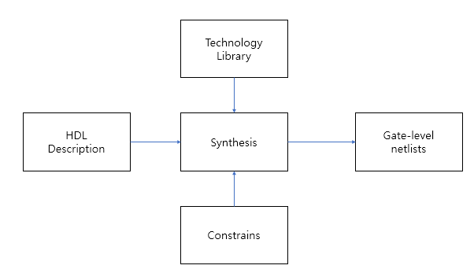
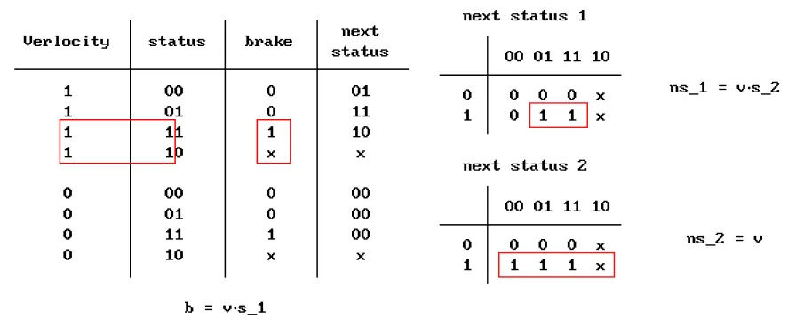

# Verilog HDL Group Study

---

## ✔ 세부 사항

---

- **‘25 Summer Semester (2025.03 - 2025.09)**
- 중앙대학교 컴퓨터 하드웨어 중앙동아리 CECOM 내부에서 진행된 Group Study
- Verilog 기초 문법, 예제를 풀고 간단한 연산을 하는 CPU 구상까지 진행

## 🧰 유용한 사이트

---

베릴로그 스터디 하는 동안 내 노트북을 사용하지 못하는 기간이 겹쳤어서 부득이하게 부분부분 Vivado 대신 외부 웹에서 코드를 돌려봤었는데, 그 때 발견한 유용한 사이트 두개가 있다.

- HDLBits
    
    [HDLBits](https://hdlbits.01xz.net/wiki/Main_Page)
    
    베릴로그계의 백준!!!! 발견하고 신나서 이것저것 풀어봄!
    조합/순차 논리회로 구별되어있어서 문법 연습/논리회로 기억 되살리기에 모두 좋은 웹사이트.. .
    
- EDA Playground
    
    [EDA Playground](https://edaplayground.com/)
    
    베릴로그, Testbench 돌려볼 수 있는 사이트가 많지 않은데,, 얘가 제일 빠릿빠릿하게 결과를 줘서 좋았다. **waveform**도 있고, **콘솔**도 있어서 제대로 동작한 게 맞는지 확인하기 좋았다.
    

## 🚩 스터디 내용 Summary

---

스터디장을 제외하고는 모두 Verilog 기초가 모자란 상황이라, IDEC 강의 수강과 과제로 기초를 채웠다!
하여 아래 적힐 대부분의 내용은 혼자들은 IDEC 강의 내용이다.

강의를 듣고나니 Verilog가 다른 언어랑은 다른 특성(시그널 타입 지정이라던가, 추상화를 얼마나 할지도 고민해야함 등등)이 많아서 무작정 시작하기보다는 꼭 한 번 듣고 시작해야 시행착오가 적은 것 같다. 

### Verilog 기초

- Verilog 구성
    
    
    
    - Constrain : 해당 모듈이 silicon에서 차지할 Area, timing, power, testability
    
- Module
    - Systems & Circuit/logic 디자인이 모듈 단위로 표현됨 (C의 함수 정도 느낌)
    - 각 Module끼리는 Signal로 연결
    - 이름은 Start with letter or underscre
    - comment : `//(한줄)` , `/* (블럭) */`
    - Module interface
        
        
        
        - 두꺼운 화살표 = multibit, 얇은거 = single (당연)
        - out인지 in인지 direction 지정
        - multi인 경우 [3:0]과 같이 MSB, LSB순으로 지정
        - signal type(`wire` or `reg`)도 지정해줘야 하는데 사실 위에 모듈 명 이후의 괄호에서 모두 해결해도 괜찮음
        
        port sig type은 괄호안에서 지정도 가능하고, 모듈 내에서도 지정가능!
        
- 다양한 추상화 레벨의 게이트 묘사 방법
    - 4 to 1 Multiflexer를 예시로 살펴보면
        - Structural Style (제일 LOW)
            - physical circuit을 그냥 스트레잇으로 말로 표현
                
                
                
        - Dataflow Style
            - input signal의 transformtation으로 output을 묘사
                
                
                
        - Behavioral Style
            - 예상되는 행동을 묘사
            - 제일 natural language에 가까워 추상화 정도가 가장 높음
                
                
                

- Signals
    - Verilog 시그널은 4개뿐
        - 0 : logic zero or false condition
        - 1 : logic one or True Condition
        - X : interpreted ‘0’ or ‘1’ or ‘Z’ or in the state of change
        - Z : HIGH IMPEDANCE 물리적 cut off
    - Classes of Signals
        
        Signal의 클래스는 여러개가 있는데 모든걸 저장하는건 불가능이니 저장 필요 여부에 따라 시그널의 클래스를 나눔
        
        - NET signal type
            
            
            
            - wire : single driver nets
            - tri : High impedance가 가능함. tri는 nets with multiple sources
            - wand, wor = 논리합성 불가 → 시뮬레이션용
        - Register(Variable)
            - C에서 변수와 동일.
            - 새거 할당하기 전까지는 유지임
    - Scalar Signals And Vectors
        - Scalar
            - single wire connection → single logical value at one time
            (e.g. `clock`)
        - Vectors (=Buses)
            - multiple-line signal → complex values and codes can be sent and recieved ( e.g. `32-bit microprocessor`)
    - Vector Specification
        - Vector가 기본형이고, 
        Scalar가 special case of vector (MSB=LSB인 vector)
        - [-5 : 0] 도 문법적으로는 허용~
    - External Signal
        - module 내부에서 정의된 signal들은 전부 internal signal
        - External Signal은 module ports로 정의
        - module port
            - input : environment에서 모듈이 data를 읽어옴, system 내부의 포트에 쓰는 건 불가능
            - output : data가 모듈에서 environment로 보내짐 system에서 읽는 건 불가능
            - inout : bi-directional

- A Structural View of System
    - **Module Instantiation**
        - module provides a template
        module template에서 object를 만드는 것 : **instantiation**
        각각의 **object = instance**
        - C언어에서 함수처럼 한 모듈에서 다른 모듈 호출 가능
        - 호출(invoke)시 verilog가 알아서 instance를 만듦
        이름은 직접 정해줘야 함 (왜냠 여러개 불러 올 수도 있자너~)
        - 베릴로그 기본제공 모듈은 인스턴스명을 안써도 됨!
    - **Port Connecting Rules**
        
        **module instantiation flexibility**를 위해서 outside와 포트 연결 시, Rule이 필요 
        모든 포트는 internal part 와 external part가 존재
        
        
        
        - **input port**
            
            **internal : `net`
            external : `net or reg`**
            
        - **inout** **port** : must be **`net** (**both**)`
        - **output** port
            
            **internal : `reg or net`
            external : `net`**
            
        - 받는 쪽 = WIRE라고 생각하면 좋음!!
    - port maping
        - ordered port list
            
            원래 모듈의 포트정의 순서대로 로컬 포트를 명시하면 됨~ (C 함수와 유사)
            
            ex ) my_module u1 (sig_a, sig_b, sig_y);
            
        - 로컬 포트명을 인스턴스 포트명 옆에 괄호를 열고 표시
            
            헷갈려서 얘를 더 자주 쓰긴 함..
            ex ) FullAdder ROW_FA3(.a(soil[6]), .b(soil[7]), .cin(soil[8]), .sum(row3[1:0]));
            

### Verilog 기본 문법

**Posible Operand Types for Expression**

- Constant
    
    <aside>
    📝
    
    **Integer Constant 표기 방법**
    
    e.g)  2’b01
    
    Verilog의 숫자 표현 방식 2 = 비트수, b = binary, 01 = binary 숫자
    
    | Value | Unsized Decimal Integer |
    | --- | --- |
    | size ‘ base value | sized integer in a specific radix(base(진수요.. 진수)) |
    
    | Base | Symbol | Legal Values |
    | --- | --- | --- |
    | unsigned binary | ‘b | 0,1,x(X), z(Z), ?, _ |
    | unsigned octal | ‘o | 0-7, x(X), z(Z), ?, _ |
    | unsigned decimal | ‘d | 0-9,_ |
    | unsigned hexadecimal | ‘h | 0-f(F),  x(X), z(Z), ?, _ |
    - singed의 경우 ‘sb, ‘so, ‘sd, ‘sh 이외 동일
    - **’b와 ‘B는 동일**
    - ? = Z의 다른 표현 방법
    - underscore는 무시됨. ONLY 인간의 가독성 때문에 씀(첨에는 못온단다)
    - 사이즈를 넘어가는 수가 담기면 상위비트 짤림(당연…)
    </aside>
    
    - literal : 23, 0.1, 2’b01
    - Named Constant : ‘define A 10, parameter A=10;
        - parameter = 로컬, define = 글로벌
- Signal
- Function call : f1(s)
- Bit-Select and Part-Select
    - `reg [7:0] DataBus;` 라고 시그널이 선언되었을 때,
        
        **`DataBus [3];`** 혹은 **`DateBus[5:2];`** 와 같은 방식으로 선택할 수 있음
        
- Operator
    - Relational Operators
        - `<` , `>` , `<=` , `>=` 등을 이용할 수 있으나, X 혹은 Z가 포함된 경우 모두 알수없음(X)가 됨
        - `===` ,`!==`  비트 단위로 비교함 → 따라서 `0xx0===0xx0` 은 `1`
        - `==` ,`!=`  값을 비교 → 따라서 X나 Z가 있는 경우 X
    - Bitwise Operators
        
        
        
        
        
        
        
    - Shift Operators
        - `<<` , `>>`
            - ex) regA << 3 을 하면 regA의 비트들이 왼쪽으로 3칸 이동 후 빈곳은 0으로 채워짐
            - `>>>` 의 경우 왼쪽으로 옮기고 0으로 채우되, sign bit는 유지
- Continous Assignment
    - 논리합성 안 됨
    - assign #3 ChipOut = Switch;
        - #3 ⇒ delay 3
        - ChipOut ⇒ **Target으로 net만 가능**
        - 우변은 암끼나 가능
- Conditional Assignment
    - 논리합성 가능
        
        
        
- **Delay**
    - #t 와 같은 방식으로 사용
    - 실제 회로에서 딜레이를 원한다면 회로를 합성해야 함 → 고로 온리 시뮬레이션 만을 위함
    - 딜레이 동안 우변값이 바뀌면 어사인 안 함!

### The Behavior Approach

- Variables (registor)
    
    
    
    - signed와 range는 reg타입의 variable에만 사용가능
    - `variable_type`
        
        
        
    - `array`
        - [first_address : last_address][first__address : last_address]와 같은 형식으로 표시
    - initial_value (option)
        - value는 simultaion time 0에 set됨
    - parameter
        - 자주 사용하는 상수는 파라미터로 이름 지정 가능
        - ex ) `Parameter` BusSize = 16;
- procedure Routines for Behavior Description
    - initial
        - Never executes again
    - always
        - power가 있는 이상 계에에ㅔ에에에에ㅔㅇ에속 함
- Variable Assignment
    - target of the assignment = register (net은 불가능)
    - initial 혹은 always 의 behavior block 앞에서 Variable 타입의 Signal을 먼저 정의해야 함

## 🖨 과제 모음

---

- **Half adder**
    
    ```verilog
    module test_HalfAdder(
        input A,
        input B,
        output S,
        output C
        );
    assign S = A ^ B ;
    assign C = A & B ;
    endmodule
    ```
    
    
    
    
    
- **Full adder**
    
    ```jsx
    module test_FullAdder(
        input A,
        input B,
        input C_in,
        output S,
        output C_out
        );
        wire s, c1, c2;
        test_HalfAdder HA1(.A(A),.B(B),.C(c1),.S(s));
        test_HalfAdder HA2(.A(s),.B(C_in),.C(c2),.S(S));
        assign C_out = c1 | c2  ;
    endmodule
    ```
    
    
    
    
    
    - 다른 방법
        
        ```verilog
        module fadd ( 
            input a, b, cin,
            output cout, sum );
            assign {cout,sum} = a + b + cin;
        endmodule
        ```
        
        **{} 으로 두 변수를 묶어서 받을 수 있다!**
        
- **8비트 가감산기**
    
    
    
    ```verilog
    module test_AdderSubstractor (
        input [7:0] x,
        input [7:0] y, 
        input sel,
        output [8:0] sum
        );
        
        wire [8:0] c; // 캐리 만들기
        if(sel)
    	    begin
    		    c[0] = 1;
    		    assign y = y ^ {8{sub}};
    		  end
    	  else
    		  assign c[0] = 0; //첫번째 carry in = 0
        
        genvar i;
        generate
            for (i = 0; i < 8; i = i + 1) begin : U2
                FA FA1(A[i], B[i], C_in[i], C_out[i+1], S[i]);
            end
    		endgenerate
    		
        assign S[8] = C_out[8];
        
    endmodule
     
    module FA (
        input A,
        input B,
        input C_in,
        output S,
        output C_out
        );
        wire s, c1, c2;
        test_HalfAdder HA1(.A(A),.B(B),.C(c1),.S(s));
        test_HalfAdder HA2(.A(s),.B(C_in),.C(c2),.S(S));
        assign C_out = c1 | c2  ;
    endmodule
    ```
    
- **4 to 1 mux**
    
    ```verilog
    module MUX4to1(
    	input A,
    	input B,
    	input C,
    	input D,
    	input [1:0] S,
    	output reg M
    );
    	
    	always @(*) 
    	begin
    		case(S)
              2'b00 : M = A;
              2'b01 : M = B;
              2'b10 : M = C;
              2'b11 : M = D;
    		endcase
    	end
    endmodule
    ```
    
    
    
- **8bit 레지스터**
    
    
    
    ```verilog
    module test_8BitRegister(
        input clk,
        input reset,
        input EN,
        input [7:0] Input,
        output reg [7:0] Output
    );
    
        always @(posedge clk) begin
            if (reset) begin
                Output = 8'b0;
            end
            else if (EN) begin
                Output = Input;
            end
        end
    
    endmodule
    ```
    
    
    
- **자동 물주기 시스템**
    
    ```verilog
    module auto_mulbburigae(
        input [8:0] soil,
        input clk,
        output reg pour_water
    );
        reg [1:0] dried_time;
        wire [1:0] row1, row2;
        wire [2:0] row3, sum1, hydrated_soil;
        FullAdder ROW_FA1(.a(soil[0]), .b(soil[1]), .cin(soil[2]), .sum(row1));
        FullAdder ROW_FA2(.a(soil[3]), .b(soil[4]), .cin(soil[5]), .sum(row2));
        FullAdder ROW_FA3(.a(soil[6]), .b(soil[7]), .cin(soil[8]), .sum(row3[1:0]));
        assign row3[2] = 1'b0;
        
        HalfAdder2bit HA1(.a(row1), .b(row2), .sum(sum1));
        HalfAdder2bit HA2(.a(sum1), .b(row3), .sum(hydrated_soil));
    
        always @(posedge clk) begin        
    		    if (hydrated_soil < 3'd6) 
    			    begin  
                if (dried_time >= 2'd2) 
    	            begin
    	                pour_water <= 1'b1;
    	                dried_time <= 2'd0;
    	            end 
                else
    	            begin
    	                pour_water <= 1'b0;
    	                dried_time <= dried_time + 1;
    	            end
    	        end 
            else 
    	        begin
    	            pour_water <= 1'b0;
    	            dried_time <= 2'd0;
    	        end
        end
    endmodule
    
    module FullAdder( 
        input a, b, cin,
        output [1:0] sum
    );
        assign sum = a + b + cin;
    endmodule
    
    module HalfAdder2bit(
        input [1:0] a,
        input [1:0] b,
        output [2:0] sum
    );
        assign sum = a + b;
    endmodule
    ```
    
    
    
- **심화문제1 : 지하철 속도 제어장치**
    
    
    
    
    
    최고속도 120km/h → 7비트 필요. . 지만 7자리는 애매하니 8자리로 진행함
    
    - **생각들**
        - 가능한 스테이터스
            
            
            
            실선 속도 90 넘는 경우, 점선 속도 90 안 넘는 경우
            
        - **k-map**
            
            
            
        - **정리**
            
            input 90 넘나 검사 넘으면 V = 1
            
            next_status = {V·S₂, V}
            
            brake = V·S₁
            
        - **코드**
            
            ```verilog
            module subway(
              input [7:0] speed,
              input clk,
              output reg brake
            );
            
              wire isFast = (speed > 8'd90);
              reg [1:0] status;
            
              always @(posedge clk) 
            	    status[0] <= isFast;
            	    status[1] <= isFast & status[0];
            	    brake     <= isFast & status[1];
            	  end
            
            endmodule
            ```
            
        - testbench (GPT한테 시켰읍니다..)
            
            ```verilog
            `timescale 1ns/1ps
            
            module subway_tb;
            
              reg [7:0] speed;
              reg clk;
              wire brake;
            
              subway uut (
                .speed(speed),
                .clk(clk),
                .brake(brake)
              );
            
              always #5 clk = ~clk;
            
              // 모니터링
              always @(posedge clk) begin
                $display("Time: %4dns | speed: %3d | brake: %b", $time, speed, brake);
              end
            
              initial begin
                // 초기화
                clk = 0;
                speed = 0;
            
                // Waveform
                $dumpfile("subway_tb.vcd");
                $dumpvars(0, subway_tb);
            
                // === 테스트 시나리오 ===
            
                // 1. 느린 속도 지속
                #10 speed = 8'd50;
                #20;
            
                // 2. 빠름 1클럭 (brake 안 켜져야 함)
                #10 speed = 8'd100;
                #10 speed = 8'd80;
            
                // 3. 빠름 2클럭 (brake 켜져야 함)
                #10 speed = 8'd100;
                #10;
                #10 speed = 8'd80;
            
                // 4. 빠름 4클럭 (brake 계속 유지)
                #10 speed = 8'd110;
                #40 speed = 8'd70;
            
                // 5. 빠름-느림 반복 (brake가 정확히 꺼졌다 켜짐 확인)
                #10 speed = 8'd100;
                #10 speed = 8'd85;
                #10 speed = 8'd100;
                #10;
                #10 speed = 8'd85;
            
                // 6. 경계 테스트 (89 → 90 → 91)
                #10 speed = 8'd89;
                #10 speed = 8'd90;
                #10 speed = 8'd91;
                #10;
                #10 speed = 8'd90;
                #10 speed = 8'd91;
                #10 speed = 8'd89;
            
                // 7. 빠름 도중 1클럭만 느림 (brake 꺼져야 함)
                #10 speed = 8'd100;
                #10;
                #10 speed = 8'd85;   // 빠름 중 잠깐 꺼짐
                #10 speed = 8'd100;
            
                // 종료
                #20;
                $finish;
              end
            
            endmodule
            ```
            
        - 결과
            
            ```verilog
            Time:    5ns | speed:   0 | brake: x
            Time:   15ns | speed:  50 | brake: 0
            Time:   25ns | speed:  50 | brake: 0
            Time:   35ns | speed:  50 | brake: 0
            Time:   45ns | speed: 100 | brake: 0
            Time:   55ns | speed:  80 | brake: 0
            Time:   65ns | speed: 100 | brake: 0
            Time:   75ns | speed: 100 | brake: 0
            Time:   85ns | speed:  80 | brake: 0
            Time:   95ns | speed: 110 | brake: 0
            Time:  105ns | speed: 110 | brake: 0
            Time:  115ns | speed: 110 | brake: 0
            Time:  125ns | speed: 110 | brake: 1
            Time:  135ns | speed:  70 | brake: 1
            Time:  145ns | speed: 100 | brake: 0
            Time:  155ns | speed:  85 | brake: 0
            Time:  165ns | speed: 100 | brake: 0
            Time:  175ns | speed: 100 | brake: 0
            Time:  185ns | speed:  85 | brake: 0
            Time:  195ns | speed:  89 | brake: 0
            Time:  205ns | speed:  90 | brake: 0
            Time:  215ns | speed:  91 | brake: 0
            Time:  225ns | speed:  91 | brake: 0
            Time:  235ns | speed:  90 | brake: 1
            Time:  245ns | speed:  91 | brake: 1
            Time:  255ns | speed:  89 | brake: 1
            Time:  265ns | speed: 100 | brake: 0
            Time:  275ns | speed: 100 | brake: 0
            Time:  285ns | speed:  85 | brake: 0
            Time:  295ns | speed: 100 | brake: 0
            Time:  305ns | speed: 100 | brake: 0
            ```
            
- **심화문제2 : 비밀번호 잠금 해제 장치**
    
    
    
    - **생각들**
        
        12비트 짜리 정답 코드 설정 001100010100
        
        12비트짜리 입력 코드 만들기
        
        매 클락 4비트 쉬프팅 + 12비트 앤드연산 
        
        맞으면 열기
        
    - **코드**
        
        ```verilog
        module DoorLock(
          input clk,
          input [3:0] key_in,
          output reg unlocked
        );
          reg [11:0] correctAnswer = 12'b001100010100;   
          reg [11:0] inputAnswer;
        
          always@(posedge clk)
            begin
              inputAnswer = {inputAnswer[7:0], key_in};
              unlocked <= (inputAnswer == correctAnswer);
            end
        endmodule
        ```
        
    - testbench (by.GPT)(순서대로 입력 2, 2, 3, 1, 2, 3, 1, 4, 5, 5, 3, 1, 4)
        
        ```verilog
        module tb_DoorLock;
        
          reg clk;
          reg [3:0] key_in;
          wire unlocked;
        
          // DUT (Device Under Test)
          DoorLock uut (
            .clk(clk),
            .key_in(key_in),
            .unlocked(unlocked)
          );
        
          // 클럭 생성 (10ns마다 반전)
          always begin
            #5 clk = ~clk;
          end
        
          initial begin
            // 초기화
            clk = 0;
            key_in = 4'b0000;  // 초기값
            $display("Time\tkey_in\tunlocked");
            $display("----------------------------------------------------");
            
            // 첫 번째 입력
            key_in = 4'b0011; #10;  // 첫 번째 4비트
            $display("%0t\t%b\t%b", $time, key_in, unlocked);
            
            // 두 번째 입력
            key_in = 4'b0001; #10;  // 두 번째 4비트
            $display("%0t\t%b\t%b", $time, key_in, unlocked);
            
            // 세 번째 입력
            key_in = 4'b0100; #10;  // 세 번째 4비트
            $display("%0t\t%b\t%b", $time, key_in, unlocked);
        
            // 정답 입력 후 unlocked 값 확인
            #10;  // 추가 지연
            $display("%0t\t%b\t%b", $time, key_in, unlocked);  // unlocked 값 출력
        
            // 잘못된 입력 시도 (정답이 아닐 때)
            key_in = 4'b1111; #10;
            $display("%0t\t%b\t%b", $time, key_in, unlocked);
            
            key_in = 4'b0000; #10;
            $display("%0t\t%b\t%b", $time, key_in, unlocked);
            
            key_in = 4'b1111; #10;
            $display("%0t\t%b\t%b", $time, key_in, unlocked);
            
            // 잘못된 입력 후 상태 출력
            #10;  // 추가 지연
            $display("%0t\t%b\t%b", $time, key_in, unlocked);  // 실패 시 unlocked = 0
        
            // 종료 (자연스럽게 종료)
            $finish;
          end
        
        endmodule
        ```
        
    - 결과
        
        
        
        
        blocking 적용시
        
        
        
        blocking 미 적용시